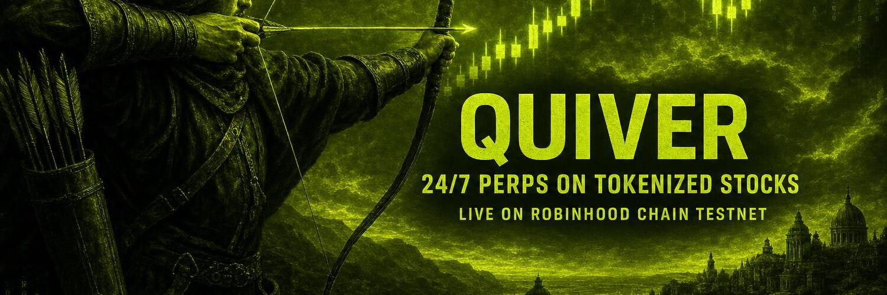

<p align="center">
  
</p>

<h1 align="center">Quiver</h1>

<p align="center"><b>Perpetual futures on tokenized stocks — fully on-chain, live on Robinhood Chain testnet.</b></p>

<p align="center">
  <a href="https://quiver-trade.com"></a>
  <a href="https://quiver-trade.com/docs"></a>
  <a href="https://quiver-trade.com/roadmap"></a>
  <a href="https://quiver-trade.com/token"></a>
  <a href="https://quiver-trade.com/leaderboard"></a>
  <a href="https://x.com/_Quivertrade"></a>
</p>

Long or short **AAPL, TSLA, NVDA, MSFT, AMZN and HOOD** with up to **20x leverage, 24/7**. Every open, close and liquidation settles on-chain through Quiver's vAMM perpetuals contract.

> Status: **live on Robinhood Chain Testnet** (chain ID 46630). Testnet only — no real funds at risk. Not affiliated with Robinhood Markets, Inc.

## Why Quiver

Stock markets close at 4pm, gate leverage, and make shorting hard. Tokenized equities put stocks on-chain — Quiver adds the derivatives layer:

- **24/7 markets** — trade nights, weekends, holidays
- **Long or short in one click** — no borrow, no locate, no broker approval
- **Up to 20x leverage** with isolated margin per position
- **On-chain settlement** — verifiable on Robinhood Chain

## Screenshots

| Landing | Trade terminal |
| --- | --- |
|  |  |

## How it works

```
Yahoo index feed ──▶ /api/keeper (signer) ──▶ QuiverPerp.setIndexPrices()
                                                     │
wallet ──▶ open/close position ──▶ vAMM (x·y=k) ──▶ mark price, PnL, liquidations
                                                     │
tUSDC faucet ──▶ margin in ──▶ QuiverVault ──▶ settlement out
```

- **vAMM (x·y=k)** — trades execute against a virtual constant-product curve for instant liquidity and transparent mark prices; no counterparty needed per trade.
- **Keeper oracle** — real stock index prices are pushed on-chain (max 1x/min) so mark stays anchored to real markets.
- **Isolated margin** — each position has its own collateral; liquidation when equity < 5% of notional, liquidators earn 50% of remaining equity. Trading fee 0.10%.

## Deployed contracts (Robinhood Chain Testnet, chain ID 46630)

| Contract | Address |
| --- | --- |
| TestUSDC (tUSDC) | [`0xafe78687b234a1fb2b8c42c3b9fdfd1c0940c770`](https://explorer.testnet.chain.robinhood.com/address/0xafe78687b234a1fb2b8c42c3b9fdfd1c0940c770) |
| QuiverVault | [`0x4ff905a4649478057edb97a421e58c5180a29e35`](https://explorer.testnet.chain.robinhood.com/address/0x4ff905a4649478057edb97a421e58c5180a29e35) |
| QuiverPerp (vAMM) | [`0xa45135a54d18b850aa248fb7078df10089cb2ad0`](https://explorer.testnet.chain.robinhood.com/address/0xa45135a54d18b850aa248fb7078df10089cb2ad0) |

RPC: `https://rpc.testnet.chain.robinhood.com` · Sources in [`contracts/`](contracts/)

## Features

- 6 markets: AAPL-PERP, TSLA-PERP, NVDA-PERP, MSFT-PERP, AMZN-PERP, HOOD-PERP
- On-chain trading panel: faucet tUSDC → open/close positions with any EVM wallet (MetaMask, WalletConnect, Coinbase Wallet)
- Demo mode: market/limit orders, TP/SL, partial close, order book, trade history
- Real index prices (Yahoo feed) + candlestick chart with timeframes
- Portfolio page: PnL curve, win rate, trade history + shareable PnL cards
- Points program & public leaderboard → $QVR airdrop allocation at TGE
- Price alerts, PWA installable, mobile-friendly

## Stack

- Next.js 15 (App Router) · React 19 · Tailwind CSS 4 · TypeScript
- wagmi + viem — wallet & contract calls on Robinhood Chain Testnet (46630)
- Solidity contracts in `contracts/` (QuiverPerp vAMM, QuiverVault, TestUSDC)
- Vercel (hosting, keeper API route, blob storage for leaderboard)

## Structure

```
app/            Next.js routes (landing, /trade, /portfolio, /leaderboard, /docs, /roadmap, /token, /risk)
app/api/        prices, candles, keeper (oracle pusher), leaderboard
components/     TradeTerminal, OnchainTrade, OnchainVault, Chart, Portfolio, ...
contracts/      QuiverPerp.sol, Quiver.sol (vault + tUSDC)
lib/            chain config, contract ABIs/addresses, markets, leaderboard
public/brand/   logo, banners, artwork · public/marketing/ article + videos
```

## Develop

```bash
npm install
npm run dev   # http://localhost:3000
```

Optional env: `KEEPER_PRIVATE_KEY` (index price pusher), `NEXT_PUBLIC_WC_PROJECT_ID` (WalletConnect).

## Links

**App** [quiver-trade.com](https://quiver-trade.com) · **Docs** [/docs](https://quiver-trade.com/docs) · **Roadmap** [/roadmap](https://quiver-trade.com/roadmap) · **$QVR** [/token](https://quiver-trade.com/token) · **Leaderboard** [/leaderboard](https://quiver-trade.com/leaderboard)

**X** [@_Quivertrade](https://x.com/_Quivertrade) · **Explorer** [explorer.testnet.chain.robinhood.com](https://explorer.testnet.chain.robinhood.com) · **Announcement** [article](public/marketing/announcement-article.md) · **Brand** [public/brand](public/brand/)

---

<p align="center"><i>Every market, one quiver.</i> 🏹</p>
