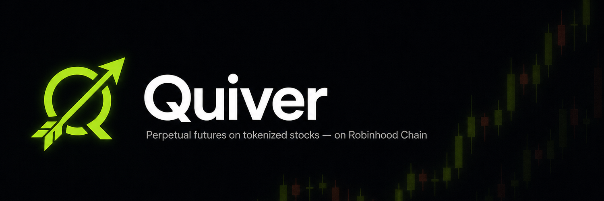
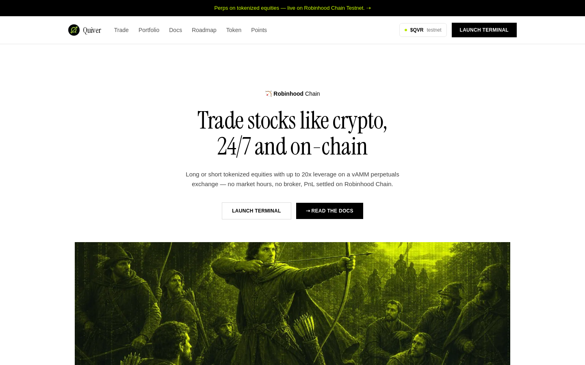
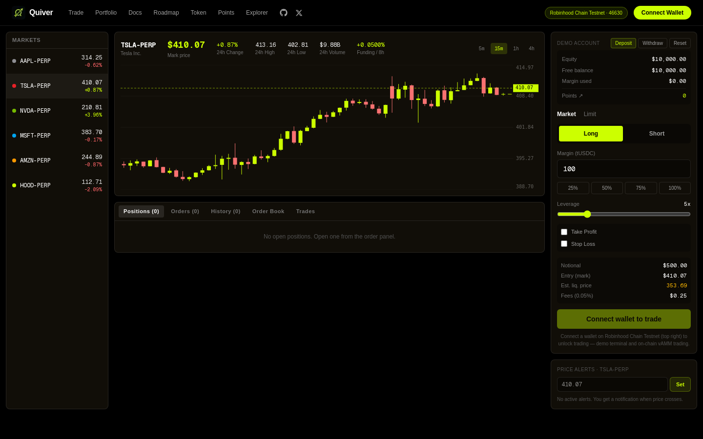

<p align="center">
  
</p>

# Quiver

**Perpetual futures on tokenized stocks — on [Robinhood Chain](https://explorer.testnet.chain.robinhood.com).**

🔗 Live demo: **https://quiver-trade.com**  ·  𝕏 [@_Quivertrade](https://x.com/_Quivertrade)

Long or short AAPL, TSLA, NVDA, MSFT, AMZN and HOOD with up to 20x leverage, 24/7. Quiver is a vAMM (x·y=k) perpetuals exchange targeting Robinhood Chain Testnet (chain ID 46630).

> Status: testnet demo. Trading is simulated client-side; contracts coming soon. Not affiliated with Robinhood Markets, Inc.

## Screenshots

| Landing | Trade terminal |
| --- | --- |
|  |  |

## Stack

- Next.js 15 (App Router) + React 19 + Tailwind CSS 4
- wagmi + viem — wallet connect on Robinhood Chain Testnet (46630) / Mainnet (4663)

## Develop

```bash
npm install
npm run dev   # http://localhost:3000
```

## Brand

Logo + X banner assets in `public/brand/`.
